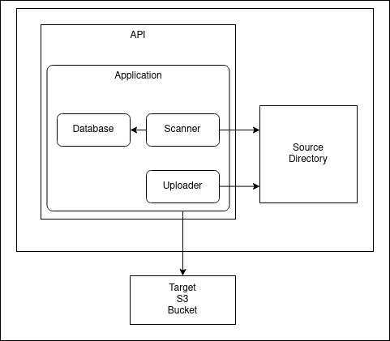

# Uploader service 

## Home Assignment for Ultima Genomics

## Requirements

python >= 3.7

`pip install -r requirements.txt`

AWS region and user with permissions for S3 upload should be defined using `aws configure`

## Local run 

`uvicorn api:uploader --reload`

Browse to http://127.0.0.1:8000/docs

## Configuration

Optional configuration can be passed using environment variables.

For example, to configure the target to a local folder instead of S3, run:

`TARGET_SETTING="/tmp/target" uvicorn api:uploader --reload`

## Architecture

Components:
* `api.py`: FastAPI wrapper
* `app.py`: Main application logic file
* `models`: Job and Task data classes
* `scanner.py`: scans a local directory
* `database`: data layer inerface and implementations
* `upload`: uploaders inerface and implementations

Considerations:
* Full seperation beween source scanner and file uploader.
* Upload tasks created by the scanner do not have order and priority.
* Upload tasks should be overwritten if a new version is detected before the previous version was uploaded.
* A file with the same name, size and modification date is considered unchanged - the scanner does not calculate file checksums.

Future:
* database implementation persistant out of process to allow upload job recovery (current implpementation is in-memory).
* Multipart upload of a big files
* Tests
* Monitoring